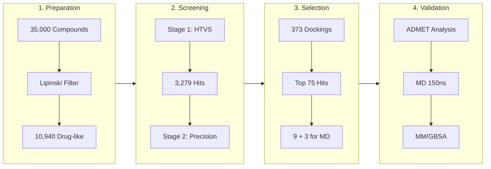

# GPR55 Allosteric Antagonist Discovery

> **Computational Drug Discovery Pipeline for Novel GPR55 Antagonists**

[](docs/PHASE_3_COMPLETE.md)
[]()
[](docs/GPR55_INTRODUCTION.md)
[](LICENSE)

---

## 🎯 Project Overview

This project aims to discover novel antagonists for **GPR55** (G protein-coupled receptor 55), an atypical cannabinoid receptor implicated in cancer progression, inflammation, and metabolic disorders.

### Key Highlights
- **35,000+ compounds** screened across **3 binding sites**
- **Top hit: -12.3 kcal/mol** (2.84 kcal/mol better than AM251 control)
- **9 novel candidates** selected for MD validation
- **3 pan-site binders** discovered (bind all 3 sites)

---

## 📊 Pipeline Workflow



### Pipeline Summary

| Stage | Input | Process | Output |
|-------|-------|---------|--------|
| **Pre-filter** | 35,000 | Lipinski Ro5 | 10,940 |
| **Stage 1** | 10,940 | HTVS (exh=8) | 3,279 |
| **Stage 2** | 750 | Precision (exh=64) | 373 |
| **Selection** | 373 | Top 25/target | 75 → **9 for MD** |

---

## 🧬 Target Sites

Three validated binding sites on GPR55:

| Site | Location | Type | Best Hit | AM251 |
|------|----------|------|----------|-------|
| **P0** | Orthosteric (TM bundle) | Competitive | **-12.3** | -9.46 |
| **P3** | Allosteric (ECL region) | Non-competitive | **-8.5** | -7.70 |
| **Interface** | GPR55-Gα contact | PPI disruption | **-9.6** | -6.27 |

---

## 🏆 Top Hits

### Best Candidates by Target

| Rank | Compound | Target | Affinity | vs AM251 |
|------|----------|--------|----------|----------|
| 1 | compound_11569386 | P0 | **-12.3** | +2.84 better |
| 2 | compound_124138019 | P0 | -11.4 | +1.94 better |
| 3 | compound_73952742 | P0 | -11.3 | +1.84 better |
| 4 | CHEMBL432162 | Interface | **-9.6** | +3.33 better |
| 5 | compound_92261630 | Interface | -9.1 | +2.83 better |
| 6 | compound_3992081 | P3 | **-8.5** | +0.80 better |

### Pan-Site Binders (Novel Finding)

**3 compounds bind ALL 3 target sites:**

| Compound | P0 | Interface | P3 |
|----------|----|-----------|----|
| compound_73952742 | -11.3 | -8.0 | -7.3 |
| compound_69204715 | -10.8 | -8.5 | -7.7 |
| compound_16947356 | -10.3 | -8.1 | -7.9 |

---

## 📈 Current Progress

| Phase | Description | Status |
|-------|-------------|--------|
| Phase 0 | Target Identification | ✅ Complete |
| Phase 1 | Protocol Validation (AM251) | ✅ Complete |
| Phase 2 | HTVS Screening | ✅ **Complete** |
| Phase 3 | Hit Selection & Analysis | ✅ **Complete** |
| Phase 4 | ADMET Profiling | 🔄 Next |
| Phase 5 | MD Simulations (150 ns × 12) | ⬜ Pending |
| Phase 6 | Binding Energy (MM/GBSA) | ⬜ Pending |

---

## 🛠️ Technologies

| Category | Tools |
|----------|-------|
| **Docking** | AutoDock Vina 1.2.5 |
| **Cheminformatics** | RDKit, Open Babel |
| **Visualization** | PyMOL, UCSF Chimera |
| **MD Simulations** | GROMACS 2021 |
| **Compute** | Google Cloud VM (8-core) |

---

## 📁 Repository Structure

```
├── docs/                    # Project documentation
├── scripts/                 # Docking and analysis scripts
│   ├── colab/              # Colab notebook scripts
│   ├── converters/         # Format conversion utilities
│   └── vm/                 # VM docking scripts
├── config/                 # Docking configuration files
├── results/                # Docking results
│   ├── htvs_top75/        # Top 75 hit PDBQT files
│   ├── stage3_results.csv # Complete results table
│   └── control_validation/ # AM251 control results
├── figures/                # Visualizations & renders
└── notebooks/              # Analysis notebooks
```

---

## 📖 Key Documentation

- [GPR55 Introduction](docs/GPR55_INTRODUCTION.md) - Target background
- [Phase 0-1 Complete](docs/PHASE_0_1_COMPLETED.md) - Validation results
- [Target Coordinates](docs/TARGET_COORDINATES.md) - Binding site definitions

---

## 📚 References

1. Eberhardt, J., et al. (2021). AutoDock Vina 1.2.0. *J. Chem. Inf. Model.* DOI: 10.1021/acs.jcim.1c00203
2. Lauckner, J.E., et al. (2008). GPR55 is a cannabinoid receptor. *PNAS* 105(7):2699-704
3. PDB 9IYA - GPR55-G protein complex structure (2025)

---

## 📜 License

This project is licensed under the MIT License - see [LICENSE](LICENSE) for details.

---

## 👤 Author

**Ayush** - [GitHub](https://github.com/Aayush-ob)

---

*Part of Bioinformatics Major Project | Timeline: Nov 2025 - Jun 2026*
