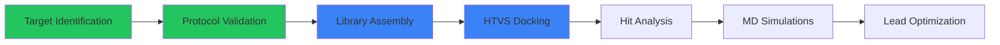

# GPR55 Allosteric Antagonist Discovery

> **Computational Drug Discovery Pipeline for Novel GPR55 Antagonists**

[](docs/PHASE_2_PREPARATION.md)
[](docs/GPR55_INTRODUCTION.md)
[](LICENSE)

---

## 🎯 Project Overview

This project aims to discover novel allosteric antagonists for **GPR55** (G protein-coupled receptor 55), an atypical cannabinoid receptor implicated in cancer progression, inflammation, and metabolic disorders.

### Pipeline Workflow



---

## 📊 Current Progress

| Phase | Description | Status |
|-------|-------------|--------|
| Phase 0 | Allosteric Target Identification | ✅ Complete |
| Phase 1 | Protocol Validation (AM251 Control) | ✅ Complete |
| Phase 2 | Library Prep & HTVS | 🔄 In Progress |
| Phase 3 | Hit Analysis & Clustering | ⬜ Pending |
| Phase 4 | MD Simulations | ⬜ Pending |
| Phase 5 | Final Analysis & Publication | ⬜ Pending |

---

## 🧬 Target Sites

Four validated allosteric binding sites on GPR55:

| Site | Location | Purpose |
|------|----------|---------|
| P0 | Intracellular cavity | Primary allosteric site |
| P3 | TM5-TM6 interface | Secondary screening target |
| Interface | EC domain interface | Novel discovery target |

---

## 🛠️ Technologies

- **Docking:** AutoDock Vina 1.2.5
- **Visualization:** PyMOL, UCSF Chimera
- **Cheminformatics:** RDKit, Open Babel
- **Compute:** Google Colab (GPU/TPU)

---

## 📁 Repository Structure

```
├── docs/                    # Project documentation
│   ├── GPR55_INTRODUCTION.md
│   ├── PHASE_0_1_COMPLETED.md
│   ├── PHASE_2_PREPARATION.md
│   └── TARGET_COORDINATES.md
├── scripts/
│   ├── colab/              # Colab notebook scripts
│   ├── converters/         # SMILES/SDF/PDBQT converters
│   └── pymol_utils/        # Visualization utilities
├── config/                 # Docking configuration files
├── results/                # Control validation results
└── figures/                # Visualizations & renders
```

---

## 📖 Key Documentation

- [GPR55 Introduction](docs/GPR55_INTRODUCTION.md) - Background on the target
- [Phase 0-1 Complete](docs/PHASE_0_1_COMPLETED.md) - Validation results
- [Phase 2 Preparation](docs/PHASE_2_PREPARATION.md) - Current HTVS setup
- [Target Coordinates](docs/TARGET_COORDINATES.md) - Binding site definitions

---

## 📚 References

1. Eberhardt, J., et al. (2021). AutoDock Vina 1.2.0. *J. Chem. Inf. Model.* DOI: 10.1021/acs.jcim.1c00203
2. Lauckner, J.E., et al. (2008). GPR55 is a cannabinoid receptor. *PNAS* 105(7):2699-704

---

## 📜 License

This project is licensed under the MIT License - see [LICENSE](LICENSE) for details.

---

*Part of Bioinformatics Major Project | Timeline: Nov 2025 - Jun 2026*
